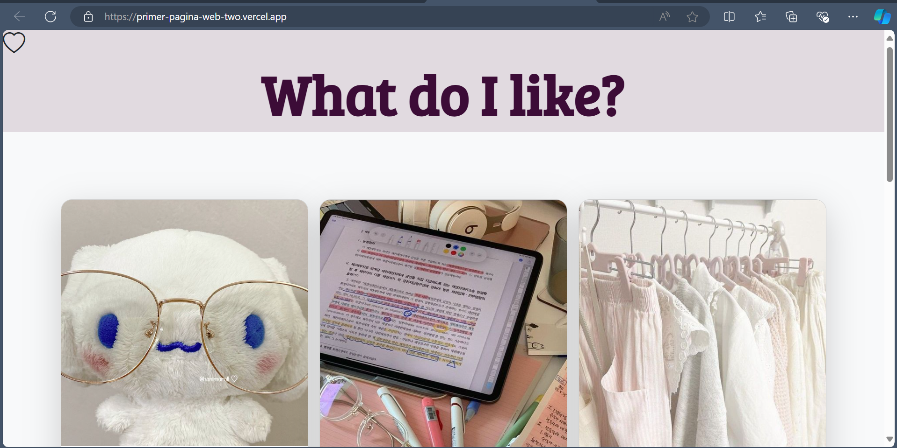
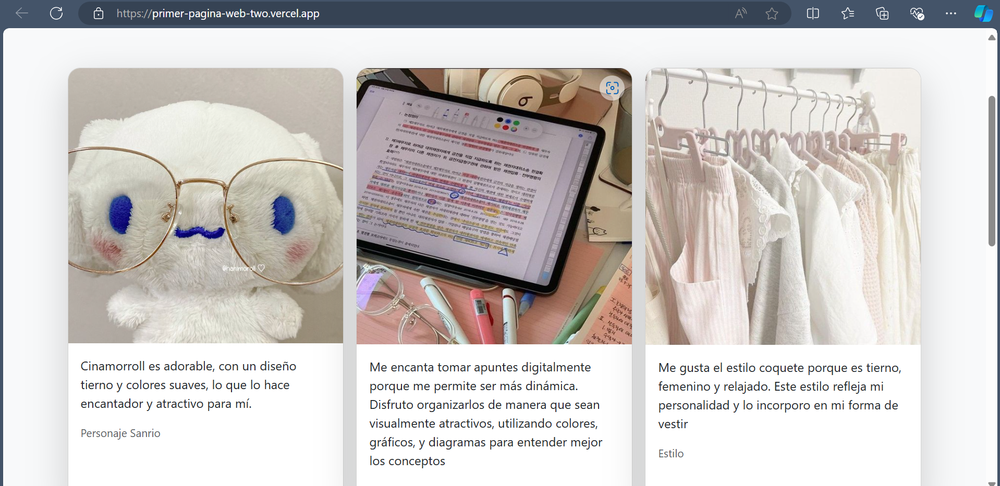
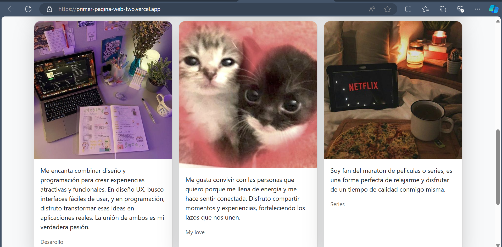
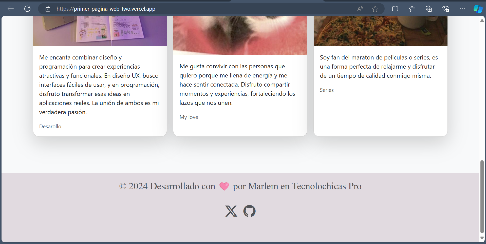

## Mi primer pagina

Esta es mi primera página web desarrollada con HTML, CSS y Bootstrap. Utilicé HTML para estructurar el contenido en secciones organizadas, mientras que el CSS me permitió personalizar la apariencia con colores, fuentes y espaciado. Para asegurar un diseño adaptativo y moderno, integré Bootstrap, aprovechando sus clases y componentes para lograr una página responsiva. 

[Proyecto Desplegado (https://primer-pagina-web-two.vercel.app/)](https://primer-pagina-web-two.vercel.app/)

## Vista previa

## Tecnologías
* HTML
* CSS
* Bootstrap

---
Desarrollado con 🩷 por [Marlem](https://portafolio-umber-alpha.vercel.app/) en [Tecnolochicas Pro](https://tecnolochicas.mx/)
